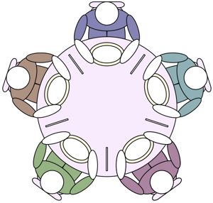

# 

[![Gem Version][gem-image]][gem-link]

[gem-image]: https://badge.fury.io/rb/celluloid.svg
[gem-link]: http://rubygems.org/gems/celluloid

## O problema - Jantar dos Filósofos

Na ciência da computação, o problema dos filósofos no restaurante é um exemplo de problema frequentemente utilizado no design de algoritmos concorrentes, para ilustrar problemas de sincronização e técnicas para resolvê-los.

Basicamente é composto por cinco filósofos (pode fazer com mais) que se sentam em uma mesa de algum restaurante, que me parece não ser muito bom, pois cada filósofo só tem um talher.

## Regras Gerais

Acontece que cada filósofo deve alternadamente pensar e comer. Só que para isso um filósofo só pode comer quando ele tiver garfo esquerdo e direito (não me pergunte por que de dois garfos, vamos chamar de talher :P ). Cada talher pode ser mantido por apenas um único filósofo por vez, e ele só poderá utilizar esse garfo se não estiver sendo utilizado por outro.

Depois que um filósofo individual terminar de comer, ele precisa soltar os dois garfos para que os gargos se tornem disponíveis para os outros.

O filósofo poderá pegar o garfo (talher) tanto da esquerda quanto da direita a medida que forem ficando disponíveis, mas não pode comecar a comer antes de obter os dois garfos e nem antes de pensar....

E isso poderá ser eterno, sim, não existe limite do quanto eles podem comer, nem da quantidade de comida ou estômago, assuma isso como base que não irá mudar.

A ideia é resolver esse problema com alguma disciplina de comportamento (algoritmo simultâneo), para que nenhum filósofo morra de fome(eles comem feito pedreiros :) ), ou seja, temos que garantir que cada um tenha a chance de comer e sempre alternando entre comer e pensar, e assumindo também que nenhum filósofo pode saber quando os outros podem querer comer ou pensar.

Mais detalhes sobre esse problema acesse aqui: [Jantar dos Filósofos - Dining Philosophres](https://en.wikipedia.org/wiki/Dining_philosophers_problem)

## Problema

O problema foi projetado para ilustrar os desafios de evitar o impasse, um estado do sistema no qual nenhum progresso é possível. Para ver que uma solução adequada para este problema não é óbvio, considere uma proposta na qual cada filósofo é instruído a comportar-se da seguinte maneira:

1. pense até que o garfo esquerdo esteja disponível; quando é, apanhe-o;
2. pense até que o garfo direito esteja disponível; quando é, apanhe-o;
3. Quando ambos os garfos são mantidos, coma por um período fixo de tempo;
4. então, coloque o garfo direito;
5. então, coloque o garfo esquerdo;
6. Repita desde o início.

Essa tentativa de solução vai falhar, porque permite que o sistema atinja um estado de impasse, em que nenhum progresso é possível. Este é um estado em que cada filósofo pegou o garfo para a esquerda e está aguardando que o garfo volte ao direito de se tornar disponível ou vice-versa. Com as instruções dadas, este estado pode ser alcançado, e quando é alcançado, os filósofos esperam eternamente o outro para liberar um garfo.

A exclusão mútua é a idéia básica do problema; os filósofos de jantar criam um cenário genérico e abstrato útil para explicar questões desse tipo. As falhas que esses filósofos podem experimentar são análogas às dificuldades que surgem na programação de computadores reais quando vários programas precisam de acesso exclusivo a recursos compartilhados. Essas questões são estudadas em programação concorrente. 

Os problemas originais da Dijkstra estavam relacionados a dispositivos externos como unidades de fita. No entanto, as dificuldades exemplificadas pelo problema dos filósofos de jantar surgem muito mais frequentemente quando vários processos acessam conjuntos de dados que estão sendo atualizados. Sistemas complexos, como os kernels do sistema operacional, usam milhares de bloqueios e sincronizações que exigem uma adesão rigorosa aos métodos e protocolos se tais problemas como deadlock, inanição e corrupção de dados devem ser evitados.

Leia mais sobre aqui: [Jantar dos Filósofos - Dining Philosophres](https://en.wikipedia.org/wiki/Dining_philosophers_problem)

## Motivação
Que inclusive tem as 3 soluções propostas: Resource hierarchy solution (Solução de hierarquia de recursos), Arbitrator solution (Solução do Árbitro) e Chandy/Misra solution (Solução Chandy / Misra).

Pegando esse problema para casos de estudo do modelo de [Actor Model](https://en.wikipedia.org/wiki/Actor_model) utilizando o Ruby e o [Celluloid](https://celluloid.io/) para caso de estudo e aplicabilidade.

## Instalação

Faça um git clone no projeto na sua pasta de escolha:

    git clone git@github.com:handersonbf/jantarDosFilosofos.git

Acessando a pasta do projeto execute:

    $ bundle install

## Estrutura

Com DeadLock

    /deadlock

Solução com Mutex

    /mutex

Solução com Actor Based

    /actor

## Para executar respectivamente

Com DeadLock

    $ ruby deadlock/iniciar_jantar.rb

Solução com Mutex

    $ ruby mutex/iniciar_jantar.rb

Solução com Actor Based

    $ ruby actor/iniciar_jantar.rb

## License

Pode baixar, alterar fazer fork :) é para estudo!